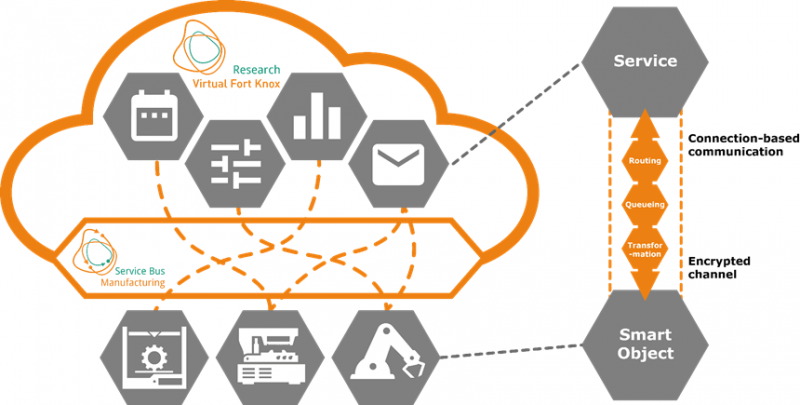

  

# Manufacturing Service Bus

The Manufacturing Service Bus (MSB) is an integration platform based on a software-oriented architecture. It enables fast and low-effort integration of smart objects (e.g. IoT devices, shopfloor machinery) and applications (e.g. database, dashboard). The MSB offers connectivity via various communication protocols such as RESTful Web Service or WebSocket API and various communication standards, for example OPC UA or MQTT. The actual integration of the connected smart objects and applications takes place via configurable connections, so-called integration flows, which can contain additional logic.

## Get started

Follow the instructions to [setup a Docker-based instance of the MSB](docker-compose/README.md) for testing and evaluation purposes.

To connect smart objects or applications, there are various client libraries and integrations available from which you can choose the one that best fits to your use case.

| Language   | Client library                                                                                         |
|------------|--------------------------------------------------------------------------------------------------------|
| Java       | [msb.client.websocket.java](https://github.com/research-virtualfortknox/msb-client-websocket-java)     |
| Python     | [msb.client.websocket.python](https://github.com/research-virtualfortknox/msb-client-websocket-python) |
| Node.js    | [msb.client.websocket.nodejs](https://github.com/research-virtualfortknox/msb-client-websocket-nodejs) |
| C          | [msb.client.websocket.c](https://github.com/research-virtualfortknox/msb-client-websocket-c)           |
| C++        | [msb.client.websocket.c](https://github.com/research-virtualfortknox/msb-client-websocket-c)           |
| C #        | [msb.client.websocket.csharp](https://github.com/research-virtualfortknox/msb-client-websocket-csharp) |
| Node-Red   | [node-red-contrib-msb](https://github.com/research-virtualfortknox/node-red-contrib-msb)               |

The connection to a [Restful-based web service can be configured](doc/msb_rest_interface.md), which is supported by a wizard in the UI.

To provide an Asset Administration Shell (AAS) for the connected service, follow the instructions for [setup and usage of the BaSyx interface](doc/msb_rest_basyx_interface.md).

## Websites

- https://virtualfortknox.de/ (official website)
- https://research.virtualfortknox.de/ (official research website)
- https://github.com/research-virtualfortknox/msb (source code and issue tracker)

## Copyright & License

Copyright (c) 2012-2024 Fraunhofer IPA. This file is part of the Virtual Fort Knox Research open source project, which is dedicated to providing the middleware for test and evaluation purposes.

Information on the license can be found in the LICENSE file, this only applies to the files contained in the repository.

To publish a commercial product that uses Manufacturing Service Bus or to use Manufacturing Service Bus productively, commercial licenses with enterprise features and support are also available: Contact info@virtualfortknox.de for more information.
