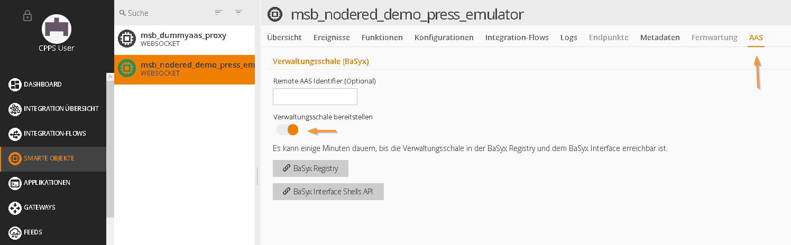
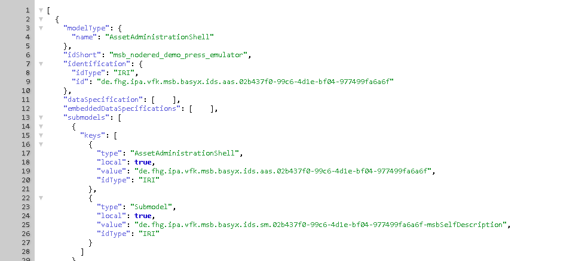
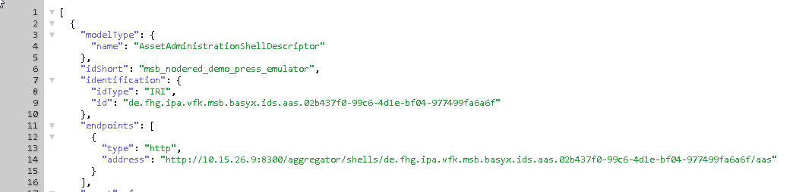
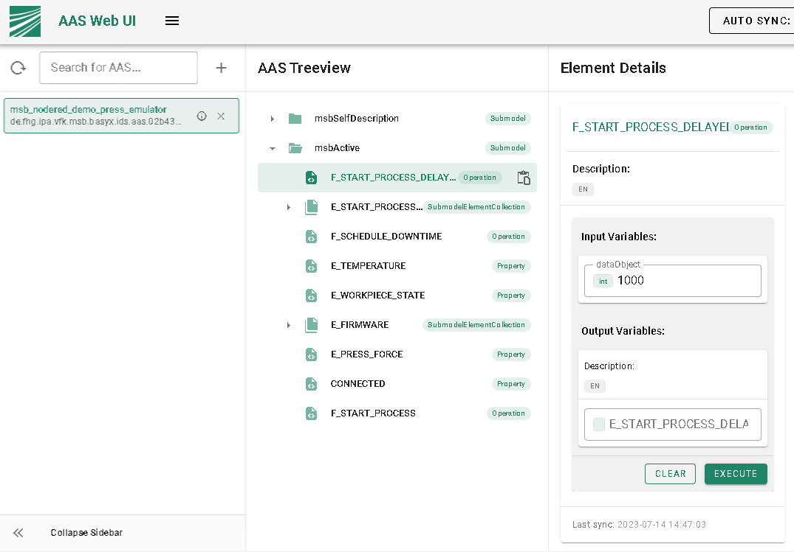

# BaSyx Interface (RESTful)

## Introduction

The MSB Rest BaSyx interface provides auto-generated Asset Administration Shells (AAS) for already connected and registered MSB services. The AAS metamodel and api are based on the "Details of the Asset Administration Shell - Part 1 and Part 2" of the Plattform Industrie 4.0 and BaSyx as reference implementation:

- [Details of the Asset Administration Shell - Part 1](https://www.plattform-i40.de/IP/Redaktion/DE/Downloads/Publikation/Details_of_the_Asset_Administration_Shell_Part1_V3.html)
- [Details of the Asset Administration Shell - Part 2](https://www.plattform-i40.de/IP/Redaktion/DE/Downloads/Publikation/Details_of_the_Asset_Administration_Shell_Part_2_V1.html)
- [BaSyx Github Repo](https://github.com/eclipse-basyx)

## Setup

Following environment variables have to be checked on startup:

    MSB_INTERFACE_BASYX_REGISTRY_URL=http://basyx.registry:4000/registry/api/v1/registry
    MSB_INTERFACE_BASYX_REGISTER_WITH_URL=http://<host-ip>:8300
    CORS_ALLOWED_HEADERS=*

## Enable AAS for MSB service

Open the MSB Gui, select your MSB service and navigate to the tab "AAS".

Enable the AAS by using the switch.

The AAS will be auto-generated and served as Shells API by the MSB BaSyx Interface.

The default endpoint is http://localhost:8300/aggregator/shells

Additionally, the AAS is registered at the specified BaSyx Registry: `http://localhost:4000/registry/api/v1/registry <http://localhost:4000/registry/api/v1/registry>`_

## AAS usage

There will be two auto-generated Submodels:

- msbSelfDescription: A submodel describing the MSB service self description using the AAS metamodel
- msbActive: A submodel to get the latest events and call functions (sync and async) using the submodel api

The submodels can be used by AAS client based services:

- AAS clients e.g. developed using the BaSyx SDK
- AAS Gui
- Postman
- Other REST clients like NodeRed, ...

## Register the submodels of an MSB service for a remote AAS (beta)

Add the remote AAS identifier field in MSB Gui to register the generated submodels for a remote AAS.

This has to be done before enabling the AAS by the switch.

Check the registry for valid submodel endpoints added to the remote AAS.
