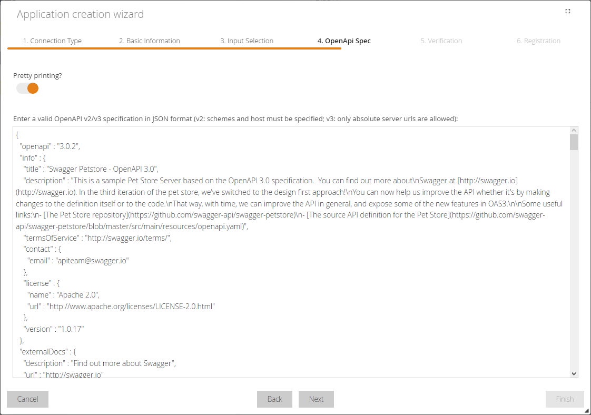

# RESTful API

## Introduction

In addition to the WebSocket and OPC-UA interfaces, the MSB also supports plain old REST to communicate with applications and smart objects. While the WebSocket and and OPC-UA interfaces allow to infere the connection state of connected smart objects and applications, the REST interface does not allow this. The reason for this is the stateless nature of REST interfaces.

The MSB's REST interface can be reached at port 8083, regardless of the cell the MSB resides in. The OpenAPI specification can be found at the same port under the path /v3/api-docs.

The MSB communication pattern splits the interaction with services in to events and functions. Events are triggered in the MSB by the service, while functions are called by the MSB in service. Events can be connected to functions in the so-called integration flows in the MSB. A special kind of event is the response event. These events can be triggered as a response from a function.

## Register an REST based service by OpenAPI wizard

Adding a new REST based service is supported by a wizard. This is shown in the following example of this pet store web service: https://petstore3.swagger.io/.

### Initial Steps

First, switch to the applications and click the Add button to open a dialog.

The following dialog gives the possibility to verify an already registered service for the user (using a secret token) and to register a new service with the help of a wizard. 
Click on the Create button to open the wizard.

First, the connection type must be selected, in this case REST, based on a OpenAPI endpoint. 
Here it is also possible to add access information, if the service has an authentication. 
Clicking on the Next button takes you to the next step of the wizard.

In this step, the descriptive information for the service is stored, such as name and description. 
Here you can also select that the service should be visible for other users of the MSB. 

 

### URL input

In this step the way the service is created can be changed. 
Here and in the following steps the "URL input" is shown. For the "File input" go to section: [File input](#file-input)

This step specifies the endpoint through which the OpenAPI specification of the REST based service can be retrieved. 
In this example, it is: https://petstore3.swagger.io/api/v3/openapi.json. 
A OpenAPI is a self-description format for a REST web service.

In this step, the entered information is displayed once again in order to check it. 
If adjustments are required, the Back button can be used to jump back to the corresponding step of the wizard.

The last step of the wizard indicates that the registration process has been completed successfully. 
With a click on the Finish button the wizard can be closed.

The newly installed service appears in the list of applications. 
If you select it, the specified basis information will be displayed.

The Events tab displays the events determined via the OpenAPI specification.

The function calls determined via the OpenAPI specification are displayed under the Functions tab.

Thus, the new REST based service is now available in the MSB and can be integrated with other services via integration flows.

### File input

In this step the way the service is created can be changed. 
Here and in the following steps the "File input" is shown. For the "URL input" go to section: [URL input](#url-input)

This step specifies the OpenAPI specification of the REST based service. 
In this example it is the content copied from: https://petstore3.swagger.io/api/v3/openapi.json. 
A OpenAPI is a self-description format for a REST web service. 
You can enter an OpenAPI specification using v2 or v3 in JSON format, but it is important that you do not use relative server paths. 
For v2, you must specify the schemas and host, and for v3, only absolute server URLs are allowed.

In this step, the entered information is displayed once again in order to check it. 
If adjustments are required, the Back button can be used to jump back to the corresponding step of the wizard.

The last step of the wizard indicates that the registration process has been completed successfully. 
With a click on the Finish button the wizard can be closed.

The newly installed service appears in the list of applications. 
If you select it, the specified basis information will be displayed.

The Events tab displays the events determined via the OpenAPI specification.

The function calls determined via the OpenAPI specification are displayed under the Functions tab.

The used OpenAPI specification are displayed under the Configurations tab as the generic configuration parameter "generic.openapi.api-docs".

Thus, the new REST based service is now available in the MSB and can be integrated with other services via integration flows.
